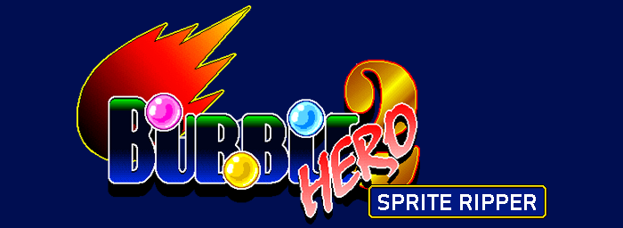
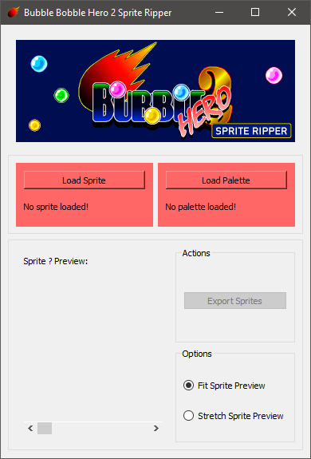
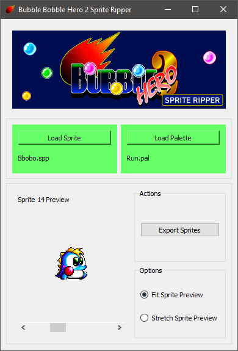

[](https://drone.matt-barnes.co.uk/mb2g17/BubbleBobbleHero2SpriteRipper)
[](https://github.com/mb2g17/BubbleBobbleHero2SpriteRipper)

## Table of contents
* [General info](#general-info)
* [Releases](#technologies)
* [Technologies](#technologies)
* [Setup](#setup)
* [Images](#images)

# General Info

This project imports sprite and palette assets used in the game Bubble Bobble Hero 2 by Lonaisoft, and extracts the images from them.

This repository contains sample assets to use this program with.

# Releases

https://git.matt-barnes.co.uk/mb2g17/BubbleBobbleHero2SpriteRipper/releases

# Technologies

This project was created with:
- Python 3.9.1
- [Qt 5](https://pypi.org/project/PyQt5/) as a UI framework
- [Pillow](https://pypi.org/project/Pillow/) for image creation

# Setup

The prerequisites for this project are:
- Python 3
- Pipenv

To install the Pipenv environment and all the project's dependencies, input:

```shell
> git clone https://git.matt-barnes.co.uk/mb2g17/BubbleBobbleHero2SpriteRipper.git
> cd BubbleBobbleHero2SpriteRipper
> make
```

To run this project, input:

```shell
> make run
```

To package this project into an executable, input:

```shell
> make package
```

To execute the test suite, input:

```shell
> make check
```

To see all `make` commands, input:

```shell
> make help
```

# Images



